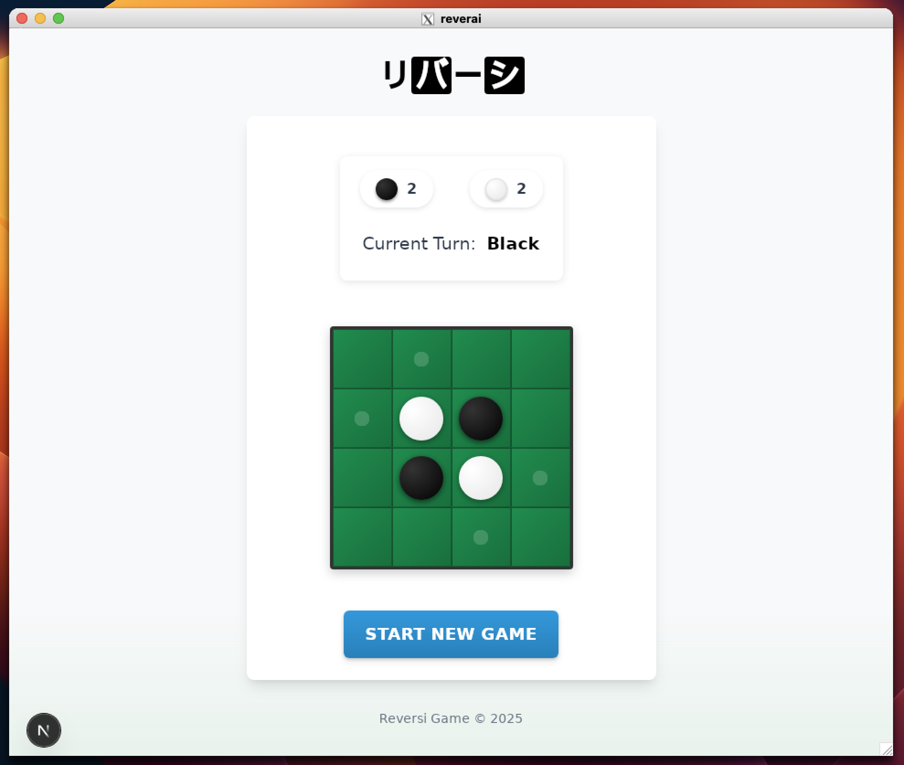

# Reverai

Reverai is entirely written using GitHub Copilot and Claude.

A 4x4 Reversi game implementation using Tauri and Next.js



## Features

- 4x4 Reversi game
- Cross-platform desktop application
- Dark mode support
- Offline support

## Project Structure

### `/spec`

Technical requirements and architecture specifications:

- `requirements.md`: Detailed technical requirements
- `spec.md`: Architecture and implementation specifications

### `/features`

BDD-style feature specifications using Gherkin:

- `01_game_board.feature`: Game board initialization and display
- `02_game_moves.feature`: Game move validation and execution
- `03_game_flow.feature`: Game flow and turn management

## Development

Requires VS Code with the Dev Containers extension.

1. Open in Dev Container
2. Run development server:

```bash
npm run tauri dev
```

## License

[MIT License](LICENSE)

## Author

[toms74209200](https://github.com/toms74209200)

and GitHub Copilot Edits agent mode with Claude.
